# Unicorn w/ RoR
_Internals, Web Hosting and Scaling_

---

# Unix Sockets

---

<!-- .slide: data-transition="convex-in none-out" -->
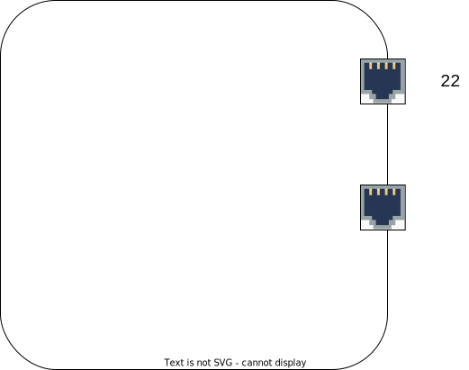

---

<!-- .slide: data-transition="fade-in none-out" -->
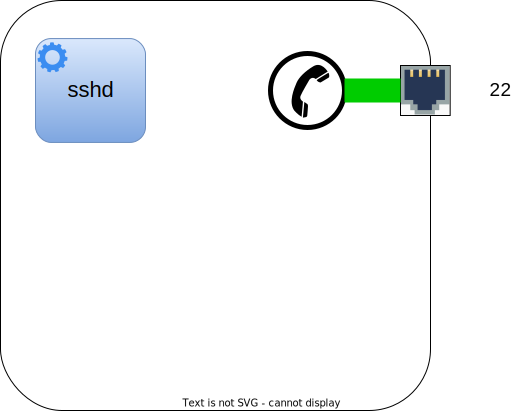

---

<!-- .slide: data-transition="fade-in none-out" -->
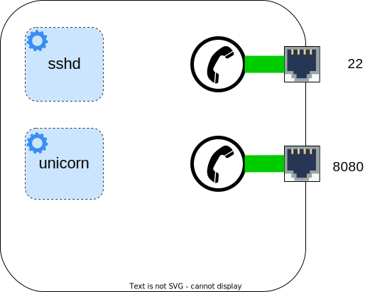

---

<!-- .slide: data-transition="fade-in none-out" -->
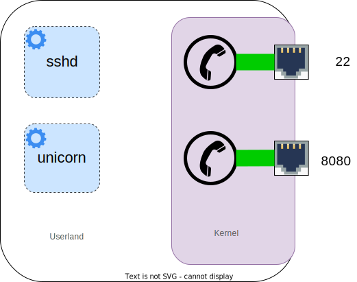

---

<!-- .slide: data-transition="fade-in convex-out" -->
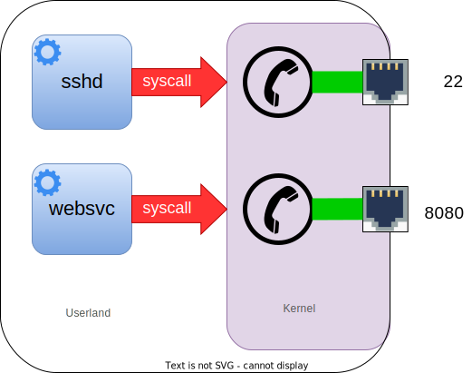

---

# fork()

Inherited resources:

* **handles** - file, socket, ...
* **code segments**
* **data segments** - copy-on-write 

---

# Unix Signals

* **INT / TERM** - quick shutdown, kills all workers
* **QUIT** - graceful shutdown
* **USR1** - reopen all logs (log rotation)
* **USR2** - reexecute the running binary
* **TTIN / TTOU** - increase/decrease the number of wokers
* **HUP** - reload the configuraion file
* **WINCH** -  keep master running, gracefully stop workers

---

# Unicorn in Action

---

<!-- .slide: data-transition="convex-in none-out" -->
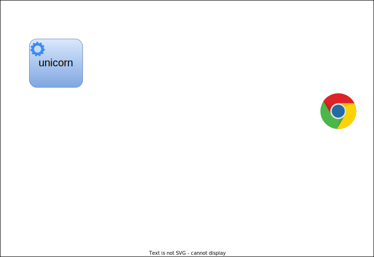

---

<!-- .slide: data-transition="fade-in none-out" -->
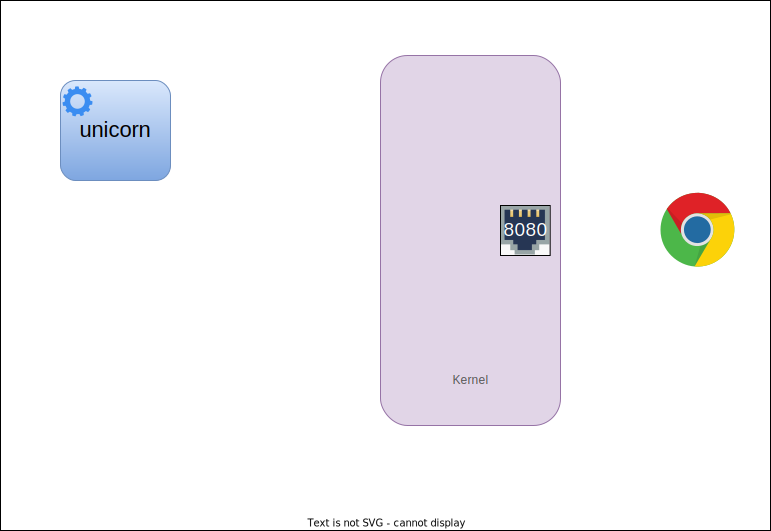

---

<!-- .slide: data-transition="fade-in none-out" -->

---

<!-- .slide: data-transition="fade-in none-out" -->

---

<!-- .slide: data-transition="fade-in none-out" -->
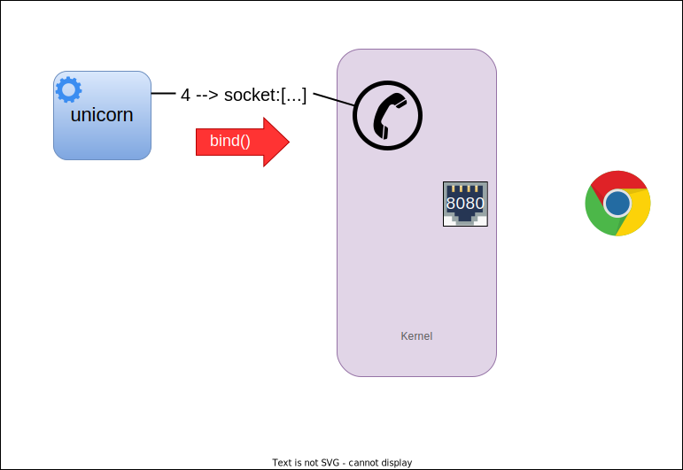

---

<!-- .slide: data-transition="fade-in none-out" -->
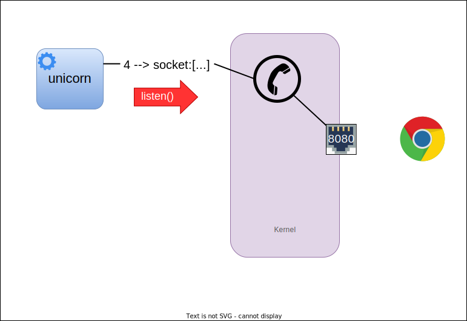

---

<!-- .slide: data-transition="fade-in none-out" -->
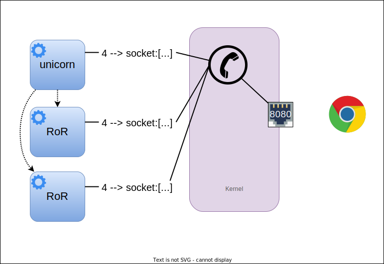

---

<!-- .slide: data-transition="fade-in none-out" -->
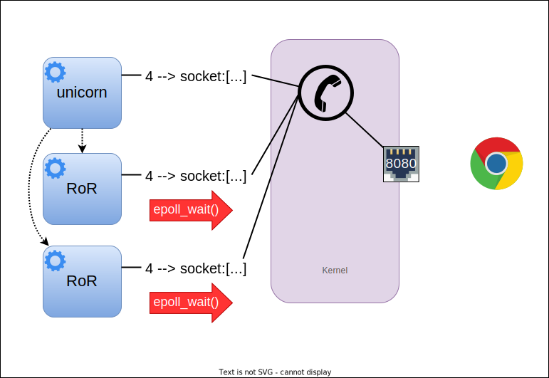

---

<!-- .slide: data-transition="fade-in none-out" -->
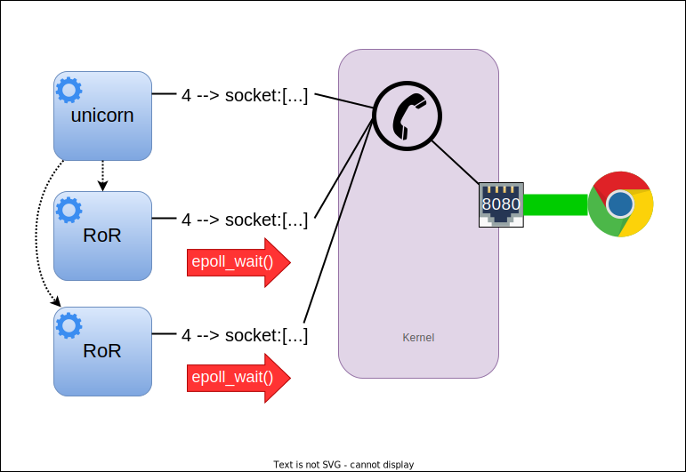

---

<!-- .slide: data-transition="fade-in none-out" -->

---

<!-- .slide: data-transition="fade-in none-out" -->
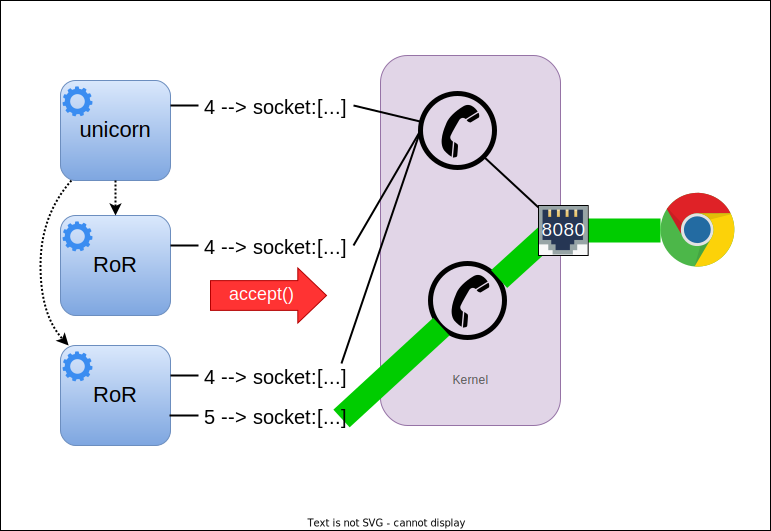

---

<!-- .slide: data-transition="fade-in convex-out" -->
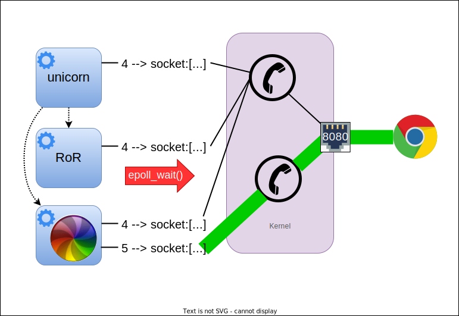

---

# Local scaling strategies

CPU Topologies

* **SMP** - Symmetric multiprocessing
* **NUMA** - Non-uniform memory access
* **SMT** - Simultaneous multi-threading
* **IMT** - Interleaved multi-threading
* *...*

|                     |    Pro           |       Con           | 
|---------------------|:----------------:|:-------------------:|
| **Multiprocessing** | Isolation        | Context switch      |
| **Multithreading**  | Memory footprint | Unhandled exception |

---

# Being locked up in container

* Resource limitations
  * OOM killer
  * freezer cgroup
* Limited hardware topology awarness
  * bind mount devices
  * privileged mode
* Image delivery (large images)
  * local- or proxy registry

---

# HTTP/1.1 - keep-alive

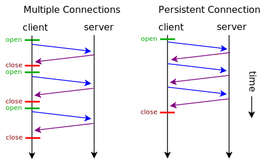

---

# HTTP/1.1 - pipelining

---

# Orchestration in (AWS) Cloud

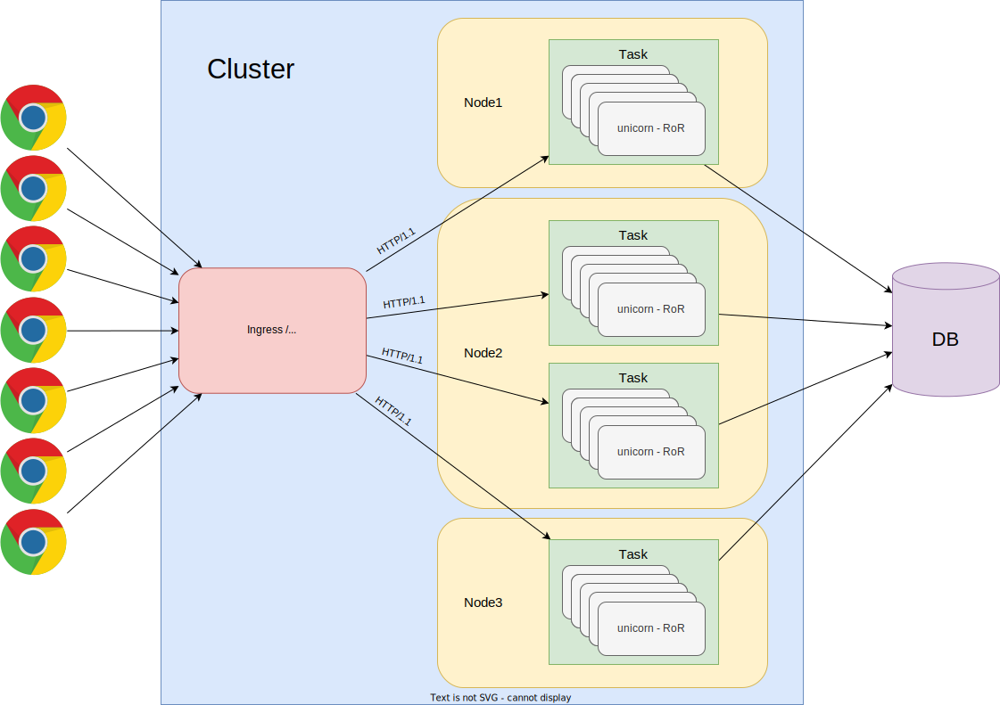

---

# DEMO Time
_Docker_

---

# Scenario #1

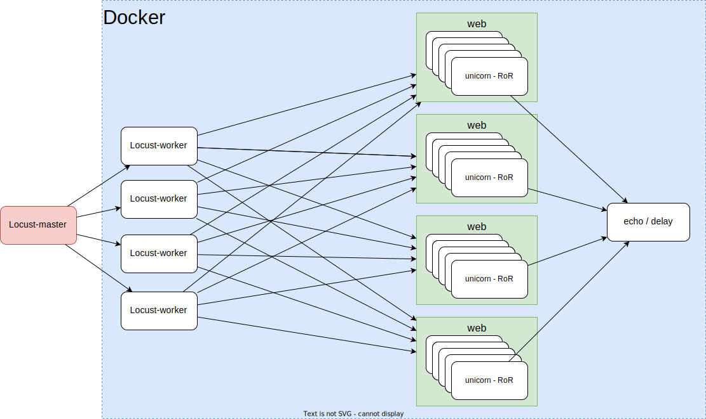

---

# Scenario #2

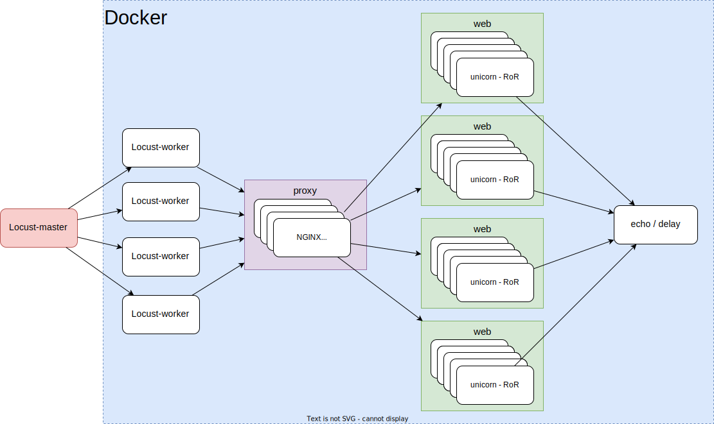

---

# 👍 _Thank You_ 👍

**presentation:** [https://revealjs.com/markdown/](https://revealjs.com/markdown/)

**drawings:** [https://drawio-app.com/](https://drawio-app.com/)

**benchmarker:** [https://locust.io/](https://locust.io/)

**e-mail:** <psaghelyi@diligent.com>
